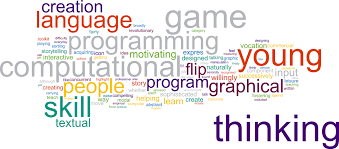

 
  From the start of learning Javascript to being able to code a few lines for some practice problems, it became evident to me that it would be a difficult language to get the hang of because there are a few slight differences from Java that I have engrained into my brain. Getting used to it will take some practice and also a bit more studying to recognize the differences in code.
  
  Javascript is honestly a very confusing language at times. There are some similarities to Java, such as the way you could structure some loops and things, but there are also a ton of differences which could make it a bit challenging to remember everything that makes it special. But I suppose that's the beauty of this language. With it being a little difficult, it is much more powerful because it is more of a scripting language that has to be run through a browser and can't make standalone apps. Whereas Java needs to be compiled and can make standalone apps. 
  
  From a software engineering perspective, I believe that Javascript is a very good language because you can manipulate the way a webpage sort of moves in accordance with the way you want it to. It works very well with HTML and CSS to create a very responsive webpage which is so much more appealing than a normal boring HTML and CSS only webpage. There is no flair when that happens. Javascript is also used to do soem scripting which I find very fascinating because its automatic and makes it feel like a real language. It's a very beneficial language which we can use for a lot of things in the industry.
  
  Athletic Software Engineering is currently pretty stressful, especially when I hear everyone typing away while I take a little of time thinking through the problem at hand. It feels a little challenging to be pressured by a time limit. I just need some time to get used to this way of learning and train myself to focus on the problem. I shouldn't be bothered by all the other outside noises and think about the other things around me. It should just be me and the code. Eventually, hopefully soon, I'll be conditioned enough to be able to solve the problems quickly and correctly. I feel like this type of learning isn't for me just yet, but sooner or later it'll work out to better me as a programmer.
