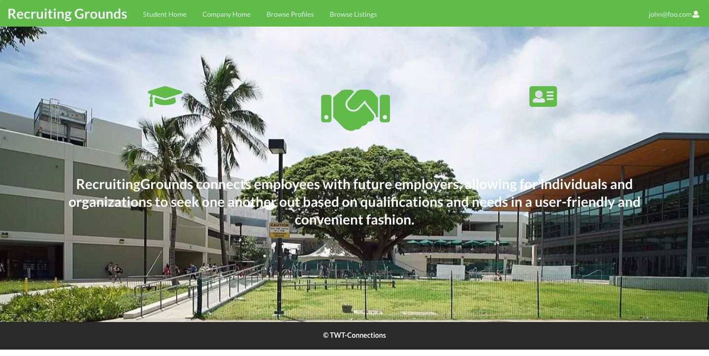

<h2>Getting Started</h2>
  For this group project, we had to use the knowledge we gained in ICS 314 which was mostly about Javascript, HTML, CSS, MongoDB and React to create a fully functional application that had the concept similar to LinkedIn, but for UH Manoa Students. We didn't spend a whole lot of time exploring the languages and the databases, but we learned enough to be able to create something that looks like it would be used in modern life. Our group formed with the intention to create something that would actually be very viable for all students and companies that would use our app. Our app would function in a way for students to be able to connect to other companies and vice versa.

<h2>Thinking Out Loud</h2>
  While we started to plan things out, we had huge ideas for what we wanted to create. We thought it would be easy for us to have the user be able to browse through multiple profiles made by other students as well as profiles created by companies that are searching for people to hire. We also wanted people to be able to manage their contacts and have the ability to connect with others through a private messaging system as well as having a public blog space for others to voice their input on each user. Such that a company could comment on a person's internship or their time at the job for other companies to view before making a decision. The problem with our though process was that we were thinking too big, without going over the tiny details that would change to make our application come to life. We also only had about a month to plan and code while having other classes to focus on in the meantime. But we did the best we could've done by implementing the things we thought were more important to the overall experience of the application.

<h2>The Execution</h2>
  In the beginning, it seemed very simple to implement all the features we wanted to since we had a template to somewhat track what we were doing with all the tools that we learned throughout the course. Everything we had at our disposal was pretty overwhelming, especially since we had to build most of the application from scratch with only having practiced and applied only a few things. But we made things work with what we had and were able to improvise. We were able to meet the expectations we set for ourselves by working diligently and within the group, we were on the same page for most of the project. 
 
   The first thing we thought of doing was creating some mockup pages in HTML and CSS to show how we want each page to look like before we implement the database so that our application can use user inputted information rather than our own generated ones. Then we developed the schema we needed for both the company and the students so that the database could control them separately which would allow us to easily modify them in case we wanted to add or subtract what the user can showcase. This process seemed to go smoothly until we reached a problem with the way we started to set the data up.

<h2>Trust the Process</h2>
  Throughout the project, we ran into a few problems that detered us from completing the goals that we've set for ourselves in the time that we needed to do it. For instance, when implementing the database to connect to the pages, we had trouble with making the page work due to our naming convention since connecting pages to the database had to be named so that we knew which part connected to which. We also had a problem of deciding what should be included in the schema so that it threw off our entire app since if the schemas don't align, the database wouldn't be filled with the right information. But even after a few struggles, we were able to figure out a way to compromise and get our application working the way we intended to.

<h2>My Contributions</h2>
  We divided the work into parts so that we could be more efficient with the amount of things that we can accomplish. I was given the task of creating the Student's Profile Page, Company Profile Page and the Editing Pages for both parts. This also includes creating the schemas so that the profiles can read data, creating the Javascript files so that they can control the information on the server side, creating the react components based on the profile pages, and the pages themselves so that the design can be modified.

<h2>Finale</h2>
  This entire project was a full learning experience which taught me valuable skills such as time management, communication, and understanding how a website with a database works. As a group, we were ecstatic to complete the project and satisfied with the finished product, but also felt bitter since there were many things that could be improved. But the most important thing is that we gained the ability to do mostly everything on ourselves which is an amazing accomplishment for us since we just started to learn how to work with databases like these within the last few months.

