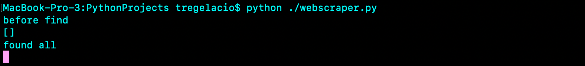

<ul>
  <li><a href="#use">How To Use</a></li>
  <li><a href="#how">How It's Made</a></li>
  <li><a href="#why">Reasons for Creating Project</a></li>
  <li><a href="#real">Real World Applications</a></li>
  <li><a href="#future">Future Improvements</a></li>
</ul>

<h2 id="use">How To Use</h2>
<ul>
  <li>First, download the python file or copy and paste it into a .py file</li>
  <li>For Mac users, open up your terminal (Finder > Applications > Utlilties > Terminal) and change into the directory where the file is located using the command "cd (Your File Directory)"</li>
  <li>For Window users, go to Start and click on Run. Type cmd into the Open field and click OK. Type cd C:\ and press Enter. cd into your directory, similar to Mac users, and type "python webscraper.py".</li>
  <li>Code should run and perform its task.</li>
</ul>

 
  <a href="https://tregelacio.github.io/projects/webscraper">Back to top</a>
 

<h2 id="how">How It's Made</h2>
I used a couple python libraries that specialize in collecting information from the html code of websites and manipulating that information to be presented how you want it to. Basically, it checks for changes in the pricing of a particular shoe on a stock exchange like site called StockX. When there is a change in price or lowest ask, it opens up a new web browser so you'll be able to buy it immediately. 
 
  <a href="https://tregelacio.github.io/projects/webscraper">Back to top</a>
 

<h2 id="why">Reasons for Creating Project</h2>
I thought this project would be a fun way to get into scripting as looking and collecting sneakers is one of my hobbies and coding works well with the culture because a lot of purchases for rare and collectable shoes are mostly online. This site works as the middleman for people to buy and sell.
 
  <a href="https://tregelacio.github.io/projects/webscraper">Back to top</a>
 

<h2 id="real">Real World Applications</h2>

 
  <a href="https://tregelacio.github.io/projects/webscraper">Back to top</a>
 

<h2 id="future">Future Improvements</h2>

 
  <a href="https://tregelacio.github.io/projects/webscraper">Back to top</a>
 
